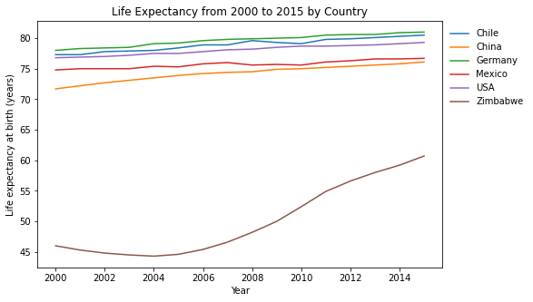
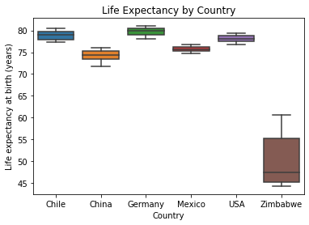
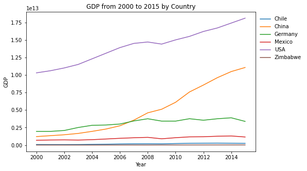
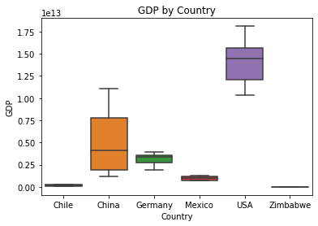

## Welcome to GitHub Pages

You can use the [editor on GitHub](https://github.com/max-torch/Life-Expectancy-Codecademy-Portfolio/edit/gh-pages/index.md) to maintain and preview the content for your website in Markdown files.

Whenever you commit to this repository, GitHub Pages will run [Jekyll](https://jekyllrb.com/) to rebuild the pages in your site, from the content in your Markdown files.

### Markdown

Markdown is a lightweight and easy-to-use syntax for styling your writing. It includes conventions for

```markdown
Syntax highlighted code block

# Header 1
## Header 2
### Header 3

- Bulleted
- List

1. Numbered
2. List

**Bold** and _Italic_ and `Code` text

[Link](url) and 
```

For more details see [GitHub Flavored Markdown](https://guides.github.com/features/mastering-markdown/).







### Jekyll Themes

Your Pages site will use the layout and styles from the Jekyll theme you have selected in your [repository settings](https://github.com/max-torch/Life-Expectancy-Codecademy-Portfolio/settings/pages). The name of this theme is saved in the Jekyll `_config.yml` configuration file.

### Support or Contact

Having trouble with Pages? Check out our [documentation](https://docs.github.com/categories/github-pages-basics/) or [contact support](https://support.github.com/contact) and we’ll help you sort it out.

<iframe src="China_GDP.html" width="800" height="600" title="China GDP" style="border:none"></iframe>
<iframe src="All_countries_scatter.html" width="800" height="600" title="All_Countries_Scatter" style="border:none"></iframe>
<iframe src="WorldMap.html" width="800" height="600" title="World_Map" style="border:none"></iframe>
